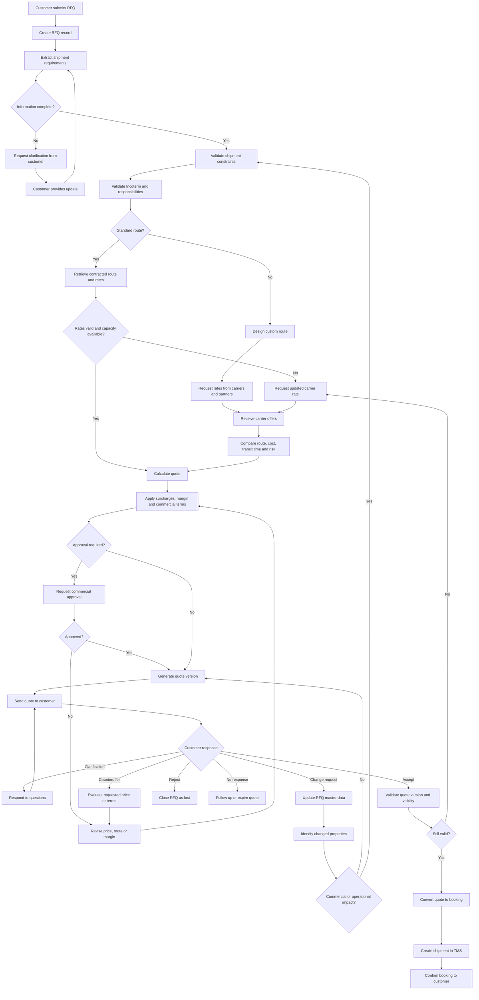

## Logistics RFQ / Quote Properties

Generic freight-forwarding domain vocabulary — the properties a real RFQ/quote
carries in the industry at large, independent of what this showcase's own
data model happens to implement today (e.g. `Status` below is the general
industry vocabulary; QMS's actual `QuoteStatus` enum is a narrower, code-real
subset — see `rfq_common/models/qms.py`). Nothing here is invented business
policy; these are standard freight-forwarding terms and mechanics.

### Shipment

* **Origin** — geographic point of departure. Sourced from masterdata
  (a Location reference), not free text.
* **Destination** — geographic point of arrival. Same sourcing as Origin.
* **Pickup date** — when the cargo is collected from the shipper.
* **Delivery deadline** — the customer's required delivery date; often
  drives mode selection (e.g. air over ocean when the deadline is tight).
* **Transport mode** — ocean / air / rail / road, or a multimodal
  combination of these.
* **Service type** — door-to-door, port-to-port, door-to-port, etc. —
  fixes which legs (pre-carriage, main carriage, on-carriage) the
  forwarder is responsible for.
* **Commodity** — what's being shipped (commodity description / HS code).
  Drives customs classification and sometimes carrier acceptance rules.
* **Weight** — gross weight of the cargo. Carriers bill on *chargeable
  weight* — the greater of gross weight and volumetric weight (below) —
  not gross weight alone.
* **Volume** — cubic measure of the cargo; converts to volumetric weight
  via a mode-specific divisor (e.g. `L×W×H(cm) / 6000` for air), the other
  half of chargeable weight. Light-but-bulky cargo can bill heavier than
  its scale weight because it occupies capacity a carrier can't sell twice.
* **Package count** — number of discrete packages/pallets/cartons —
  affects handling cost and customs documentation.
* **Dimensions** — length/width/height of the cargo. Feeds the volumetric-
  weight calculation and equipment-fit checks (does it physically fit the
  container/aircraft/vehicle).
* **Stackable** — whether packages can be stacked in transit. Affects how
  densely a container/trailer can be loaded, and therefore cost per unit.
* **Hazardous goods** — whether the cargo falls under an IMDG (sea) / IATA
  DGR (air) dangerous-goods class. Triggers special documentation, handling
  fees, and can rule out certain carriers/routes entirely.
* **Temperature control** — whether the cargo needs a reefer (refrigerated)
  container or vehicle. Adds equipment cost and continuous monitoring.
* **Special handling** — anything outside standard handling (oversized,
  fragile, high-value, project cargo) — usually priced as its own surcharge.

### Route

* **Standard or custom** — whether the shipment moves over an existing
  contracted lane, or needs ad hoc routing designed for this RFQ.
* **Direct or multimodal** — a single-mode point-to-point move vs a route
  combining multiple modes (e.g. ocean leg + rail leg + road leg).
* **Routing points** — the intermediate ports/terminals/hubs the shipment
  passes through between origin and destination.
* **Transit time** — total elapsed time from pickup to delivery for this
  specific route.
* **Departure frequency** — how often a carrier services this route (e.g.
  weekly sailings) — determines how soon a booking can actually move.
* **Carrier** — the transport operator running this leg/route.
* **Equipment type** — container size/type (20ft, 40ft, reefer, flat-rack)
  for ocean, or aircraft/vehicle type for air/road.
* **Capacity availability** — whether space is currently bookable on this
  route right now. A volatile operational fact, distinct from the route's
  static topology (origin/destination/mode never changes; availability
  does, hour to hour).

### Commercial

* **Incoterm** — an ICC-standard delivery term (FOB, DAP, EXW, etc.) that
  fixes exactly where cost and risk transfer from seller to buyer. Decides
  which legs and cost lines the forwarder's quote must actually include.
* **Currency** — the currency the quote is denominated in for the customer.
* **Base freight** — the carrier's core transport charge, before surcharges.
* **Fuel surcharge** — a variable charge tracking fuel-price volatility
  (BAF — Bunker Adjustment Factor — for ocean; a similar mechanism for air).
* **Customs charges** — duties, taxes, and brokerage fees to clear the
  shipment through customs at origin/destination.
* **Terminal charges** — port/airport terminal handling fees (THC) at
  origin and destination.
* **Pickup charge** — cost of the pre-carriage leg (collecting cargo from
  the shipper to the origin terminal).
* **Delivery charge** — cost of the on-carriage leg (final delivery from
  the destination terminal to the consignee).
* **Insurance** — cargo insurance premium, when included in the quote.
* **Taxes** — VAT or other taxes applicable to the transport service itself
  (distinct from customs duty on the goods).
* **Margin** — the forwarder's markup over total cost. What a margin-floor
  rule (this showcase's R1) actually governs.
* **Total price** — the final sell price quoted to the customer: total cost
  plus margin plus every line above.

### Validity

* **Quote ID** — the aggregate's stable identifier across every revision.
* **Version** — which revision of the quote this is, in an append-only
  history (a quote is never edited in place — see Revision below).
* **Valid from / Valid until** — the window during which the quoted price
  and terms are honored. Both the rate and the booked capacity can expire
  independently of each other (see Rate source / Capacity validity).
* **Rate source** — which rate card or carrier quote this version's pricing
  was built from. Needed to explain *why* a price changed between versions.
* **Capacity validity** — whether the capacity this quote assumed is still
  actually held/bookable — a separate fact from price validity; a rate can
  still be valid while the space behind it is gone.
* **Assumptions** — conditions the quote relies on without guaranteeing
  (e.g. "assumes standard customs clearance, no inspection hold").
* **Exclusions** — costs or scenarios explicitly *not* covered by this
  quote (e.g. demurrage, storage beyond free time, customs delays).

### Parties

* **Customer** — who requested the quote.
* **Shipper** — who physically hands the cargo over at origin. Often the
  same as Customer, but not always (e.g. a supplier shipping on the
  customer's behalf).
* **Consignee** — who receives the cargo at destination. Often the same as
  Customer, but not always.
* **Forwarder** — the party issuing the quote (this business).
* **Carrier** — the actual transport operator (ocean line, airline,
  trucking company) — distinct from the Forwarder, who arranges but
  usually doesn't own the transport capacity.
* **Billing party** — who gets invoiced. Can differ from both Shipper and
  Consignee (e.g. a third-party payer named in the commercial terms).

### Status

Generic industry vocabulary for where a quote sits in its lifecycle — not
this codebase's literal `QuoteStatus` enum (`draft/priced/approval_required/
approved/published/accepted/rejected/revise/expired/withdrawn`), though the
two map closely.

* **Draft** — the quote is being composed, not yet sent to the customer.
* **Waiting for information** — blocked on the customer supplying missing
  shipment details before pricing can proceed.
* **Waiting for carrier** — blocked on a carrier's rate or capacity response.
* **Under review** — internal commercial/pricing review before the quote
  can be released.
* **Sent** — delivered to the customer, awaiting their response.
* **Revised** — a new version was issued after the customer requested a
  change (see Revision below).
* **Accepted** — the customer has committed to this quote; normally
  converts to a booking.
* **Rejected** — the customer declined the quote.
* **Expired** — the validity window passed with no customer response.

### Revision

A quote version is never edited in place — a change always produces a new,
immutable version that *supersedes* the prior one (append-only history).
These properties describe that supersession, not a mutation:

* **Previous version** — pointer to the version this one supersedes.
* **Changed fields** — exactly which attributes differ from the prior
  version. Needed for a customer-facing "here's what changed" explanation,
  not just a raw diff.
* **Change reason** — why a new version was issued (e.g. route became
  unavailable, FX moved past threshold, customer requested a change).
* **Price impact** — how total price moved relative to the prior version.
* **Route impact** — how route/transit time moved relative to the prior
  version.
* **Approval required** — whether *this* revision needs to go back through
  commercial approval. A revision doesn't inherit a free pass just because
  an earlier version of the same quote was already approved.
* **Customer confirmation required** — whether the customer must actively
  re-accept this revision, or it can simply be sent as an update to a quote
  they haven't responded to yet.


---


For logistics RFQs, there is rarely a single system of record. Instead, the process spans several systems, each owning a different part of the truth.

| Business Object              | Typical System of Record  |
| ---------------------------- | ------------------------- |
| Customer                     | CRM                       |
| RFQ / Opportunity            | CRM or Quote Management   |
| Customer communication       | Email / CRM               |
| Customer master data         | ERP / CRM                 |
| Locations                    | TMS / ERP                 |
| Carrier contracts            | TMS or Rate Management    |
| Spot carrier quotes          | Procurement / TMS         |
| Tariffs & rate cards         | Rate Management System    |
| Shipment planning            | TMS                       |
| Incoterms & commercial rules | ERP / TMS                 |
| Cost estimates               | TMS / Pricing Engine      |
| Sales price                  | QMS / Quote Management    |
| Quote document               | QMS / Document Management |
| Booking                      | TMS                       |
| Shipment execution           | TMS                       |
| Invoice                      | ERP                       |
| Financials                   | ERP                       |

### Typical enterprise landscape

```text
Customer
    │
    ▼
CRM
    │
    ├── RFQ
    ├── Opportunity
    └── Contacts
         │
         ▼
QMS / Quote Management
         │
         ├── Pricing
         ├── Quote Versions
         └── Approval
              │
              ▼
TMS
         │
         ├── Routes
         ├── Carrier Contracts
         ├── Capacity
         ├── Shipments
         └── Booking
              │
              ▼
ERP
         ├── Customer Master
         ├── Finance
         ├── Invoicing
         └── Accounting
```

### In practice

A freight forwarder might work like this:

* **CRM** (e.g. Salesforce): customer requests, opportunities, sales pipeline.
* **TMS**: lanes, carriers, routing, bookings, shipment execution.
* **Rate Management**: contract rates and tariffs.
* **ERP**: invoicing, accounting, customer master.
* **Email**: negotiations with customers and carriers.
* **Excel**: ad hoc pricing models and special cases (still very common).

### Where is the "system of record"?

It depends on the object:

* **Customer** → CRM or ERP
* **Quote** → QMS / Quote Management
* **Carrier rates** → TMS or Rate Management
* **Shipment** → TMS
* **Invoice** → ERP
* **Commercial documents** → DMS or QMS

This fragmentation is one of the reasons RFQ automation is difficult: a quote requires assembling information from multiple authoritative systems, plus unstructured conversations (emails, attachments, calls). There is often **no single system that contains a complete, current picture of the RFQ**. An orchestration layer—or an agentic system—typically has to reconcile these sources rather than replace them.


---


