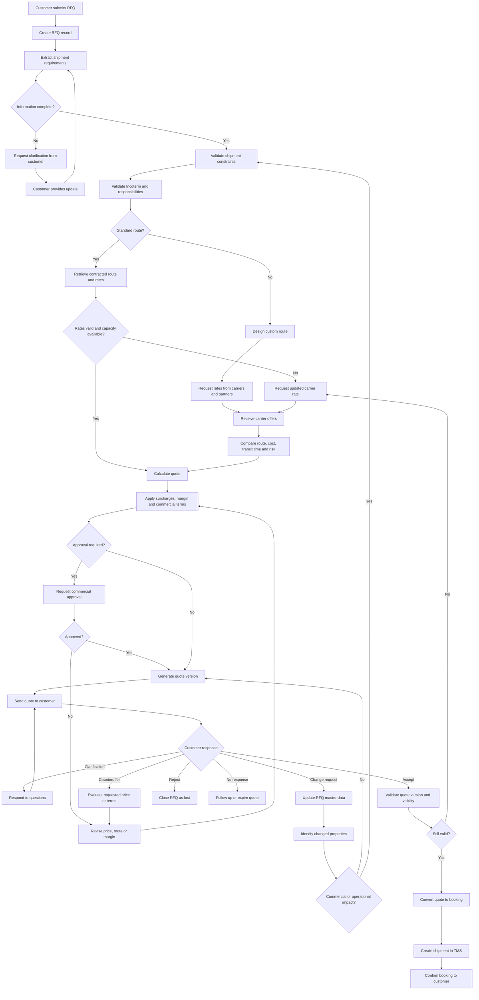

## Logistics RFQ / Quote Properties

### Shipment

* Origin
* Destination
* Pickup date
* Delivery deadline
* Transport mode
* Service type
* Commodity
* Weight
* Volume
* Package count
* Dimensions
* Stackable
* Hazardous goods
* Temperature control
* Special handling

### Route

* Standard or custom
* Direct or multimodal
* Routing points
* Transit time
* Departure frequency
* Carrier
* Equipment type
* Capacity availability

### Commercial

* Incoterm
* Currency
* Base freight
* Fuel surcharge
* Customs charges
* Terminal charges
* Pickup charge
* Delivery charge
* Insurance
* Taxes
* Margin
* Total price

### Validity

* Quote ID
* Version
* Valid from
* Valid until
* Rate source
* Capacity validity
* Assumptions
* Exclusions

### Parties

* Customer
* Shipper
* Consignee
* Forwarder
* Carrier
* Billing party

### Status

* Draft
* Waiting for information
* Waiting for carrier
* Under review
* Sent
* Revised
* Accepted
* Rejected
* Expired

### Revision

* Previous version
* Changed fields
* Change reason
* Price impact
* Route impact
* Approval required
* Customer confirmation required


---


For logistics RFQs, there is rarely a single system of record. Instead, the process spans several systems, each owning a different part of the truth.

| Business Object              | Typical System of Record  |
| ---------------------------- | ------------------------- |
| Customer                     | CRM                       |
| RFQ / Opportunity            | CRM or Quote Management   |
| Customer communication       | Email / CRM               |
| Customer master data         | ERP / CRM                 |
| Locations                    | TMS / ERP                 |
| Carrier contracts            | TMS or Rate Management    |
| Spot carrier quotes          | Procurement / TMS         |
| Tariffs & rate cards         | Rate Management System    |
| Shipment planning            | TMS                       |
| Incoterms & commercial rules | ERP / TMS                 |
| Cost estimates               | TMS / Pricing Engine      |
| Sales price                  | QMS / Quote Management    |
| Quote document               | QMS / Document Management |
| Booking                      | TMS                       |
| Shipment execution           | TMS                       |
| Invoice                      | ERP                       |
| Financials                   | ERP                       |

### Typical enterprise landscape

```text
Customer
    │
    ▼
CRM
    │
    ├── RFQ
    ├── Opportunity
    └── Contacts
         │
         ▼
QMS / Quote Management
         │
         ├── Pricing
         ├── Quote Versions
         └── Approval
              │
              ▼
TMS
         │
         ├── Routes
         ├── Carrier Contracts
         ├── Capacity
         ├── Shipments
         └── Booking
              │
              ▼
ERP
         ├── Customer Master
         ├── Finance
         ├── Invoicing
         └── Accounting
```

### In practice

A freight forwarder might work like this:

* **CRM** (e.g. Salesforce): customer requests, opportunities, sales pipeline.
* **TMS**: lanes, carriers, routing, bookings, shipment execution.
* **Rate Management**: contract rates and tariffs.
* **ERP**: invoicing, accounting, customer master.
* **Email**: negotiations with customers and carriers.
* **Excel**: ad hoc pricing models and special cases (still very common).

### Where is the "system of record"?

It depends on the object:

* **Customer** → CRM or ERP
* **Quote** → QMS / Quote Management
* **Carrier rates** → TMS or Rate Management
* **Shipment** → TMS
* **Invoice** → ERP
* **Commercial documents** → DMS or QMS

This fragmentation is one of the reasons RFQ automation is difficult: a quote requires assembling information from multiple authoritative systems, plus unstructured conversations (emails, attachments, calls). There is often **no single system that contains a complete, current picture of the RFQ**. An orchestration layer—or an agentic system—typically has to reconcile these sources rather than replace them.


---


