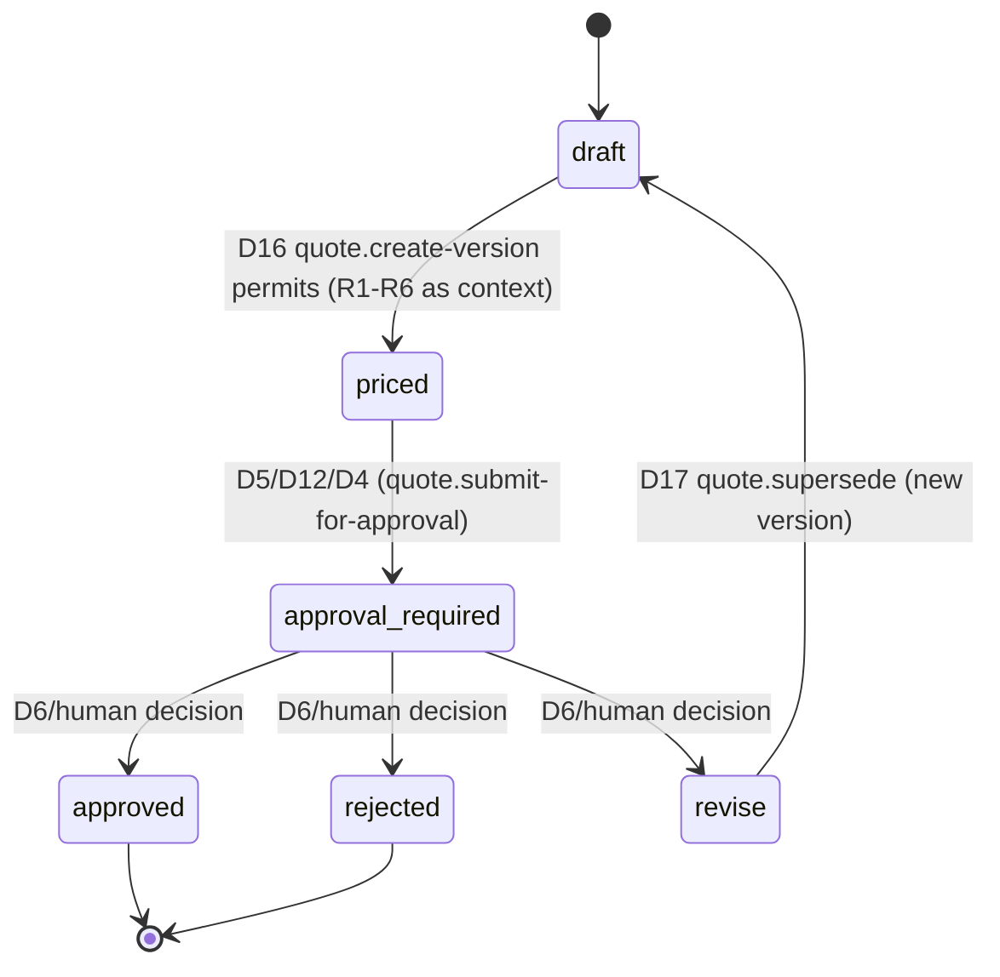

# QMS pricing rules — the repricing subprocess

DMN-style decision tables (lightweight: markdown, not full DMN XML) for the
business rules a `Quote` version's numbers must satisfy. Companion to
`business/decisions.md` (the *authorization* questions) — this file is the
*business logic* those decisions evaluate against. Every threshold here is
canonical elsewhere in the project (not invented for this doc): matches
`decisions.md`'s "Threshold coverage" table and the worked example in
`domain-model.yaml`'s `RouteRecommendation.triggered_thresholds`.

Formulas use `_x10` fixed-point (tenths of a percent, integer) — the
convention already used throughout `policies.cedar`/`domain-model.yaml`
(e.g. `fx_variance_pct_x10 > 20` means "> 2.0%"), so a rule's numbers are
directly the Cedar policy's `context` values, not a separate unit system.

## R1 — Margin floor

| Rule | Formula | Threshold | Outcome |
| --- | --- | --- | --- |
| R1 | `margin_pct_x10 = round((sell_price_cents - total_cost_cents) / sell_price_cents * 1000)` | `margin_pct_x10 < margin_floor.value_pct_x10` (customer's `MarginFloor`, effective-dated) | Quote may still be proposed, but requires commercial approval — **D5** (`propose-below-floor` + `oblig-commercial-approval`) |

Worked example (`domain-model.yaml`): `actual_pct_x10: 50` (5.0% margin) vs
`threshold_pct_x10: 60` (6.0% floor) — below floor, D5 applies.

## R2 — FX variance since prior quote

| Rule | Formula | Threshold | Outcome |
| --- | --- | --- | --- |
| R2 | `fx_variance_pct_x10 = round(abs(current_rate - quote_rate) / quote_rate * 1000)` | `<= 20` (2.0%) | FX quiet — baseline permit, **D12** |
| | | `> 20` | Automatic quote replacement is **forbidden** — **D4b** (`forbid-auto-replace-on-fx`). A human-initiated recalculation is still permitted, with a notify obligation — **D4a** / `fx-permit-recalc` + `oblig-notify-pricing-manager` |

Worked example: `actual_pct_x10: 27` (2.7% move) vs `threshold_pct_x10: 20`
(2.0%) — over threshold, D4b blocks the *automatic* path (matches the
mock-fx CNY/EUR scenario-pack breakout, `fixtures/scenario-packs/cny-eur-threshold.yaml`).

`quote_rate` here is the `ExchangeRate.rate_ref` the *current* quote version
was priced against — never a live re-fetch — so this rule is reproducible
against history, not wall-clock-dependent.

## R3 — Route cost variance vs. baseline

| Rule | Formula | Threshold | Outcome |
| --- | --- | --- | --- |
| R3 | `cost_variance_pct_x10 = round((new_route_cost_cents - baseline_route_cost_cents) / baseline_route_cost_cents * 1000)` | `> 80` (8.0%) | Permit + review obligation — **D8** (`recommend-high-cost-variance` + `oblig-cost-variance-review`) |

## R4 — Transit time variance

| Rule | Formula | Threshold | Outcome |
| --- | --- | --- | --- |
| R4 | `transit_variance_days = new_transit_days - baseline_transit_days` | `> 3` | Permit + review obligation — **D9** (`recommend-slower-transit` + `oblig-transit-review`) |

## R5 — Non-contracted lane

| Rule | Condition | Outcome |
| --- | --- | --- |
| R5 | `recommended_lane_id != RFQ.contracted_lane` | Permit + review obligation — **D3b** (`recommend-noncontracted-lane` + `oblig-lane-deviation`). If equal: **D3a**, no obligation. |

## R6 — Quote value vs. delegated approval limit

| Rule | Condition | Outcome |
| --- | --- | --- |
| R6 | `quote_value_eur_cents <= approver.delegated_limit_eur_cents` | Commercial manager may approve directly — **D6** (`manager-may-approve-within-limit`) |
| | `quote_value_eur_cents > approver.delegated_limit_eur_cents` | Outside any single approver's limit — escalation path, **not yet modeled** (no decision covers this today; a gap, not an oversight) |

## Where these rules run

R1–R6 are evaluated when the commercial agent assembles a new quote version
— the rule outputs (margin_pct_x10, fx_variance_pct_x10, etc.) become the
`context` **D16** (`quote.create-version`) passes to Cedar. R1–R6 are pure
business math; Cedar only ever sees their *results*.

D16 has exactly one job: *may the commercial agent create this quote
version at all* (`draft → priced`). It does **not** decide what happens
next — that's a separate question, answered by whichever of **D5**
(below-floor margin), **D12** (baseline, FX quiet + margin at/above floor),
or **D4** (FX moved) actually determines `quote.submit-for-approval`
(`priced → approval_required`). Collapsing those two decisions into one
would make D16 both author the quote *and* decide its workflow state —
two different questions with two different answers.

## Quote lifecycle (state machine)

`revise` does not mutate the existing version — it triggers **D17**
(`quote.supersede`), which, if permitted, produces a *new* `Quote` row
(`version + 1`, `prior_version` set) starting back at `draft`. The
`approval_required → approved | rejected | revise` transition is itself the
human-in-the-loop decision (`decisions.md`'s "Human-in-the-loop = a status
change" principle) — unchanged by this doc.
