# Transport Planner — an agentically enhanced job

This is an onboarding example for a logistics company that uses software
workers to support selected responsibilities in an existing job.

The job does not disappear. The planner still understands the customer’s needs,
weighs competing priorities, and takes responsibility for the operational
decision. Some of the research and preparation around that decision is carried
out by specialist company services.

## Meet the Transport Planner

A Transport Planner plans, tenders, and routes daily shipments. They are
expected to:

- create routes that fit distance, time, traffic, and customer requirements;
- identify suitable cost and transport-mode options;
- monitor shipments and adjust plans when conditions change;
- communicate with carriers and drivers; and
- analyze carrier trends and service issues.

This is a broad job. The company does not treat every responsibility as a
candidate for automation. It selects a few activities where software can gather
evidence and prepare useful work for the planner.

## The organization behind the role

The directory data can be presented as a conventional organization chart. This
is the human structure in which the Transport Planner works; it is not an agent
architecture diagram.

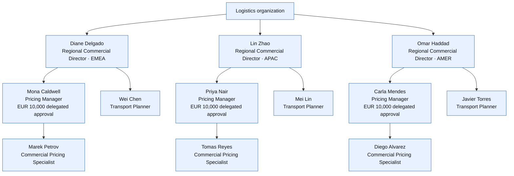

## The planner’s immediate team

The Transport Planner works within a small team. The planner’s direct manager is
the Regional Commercial Director. Pricing colleagues work alongside the planner
when a route recommendation affects a quotation or a commercial decision.

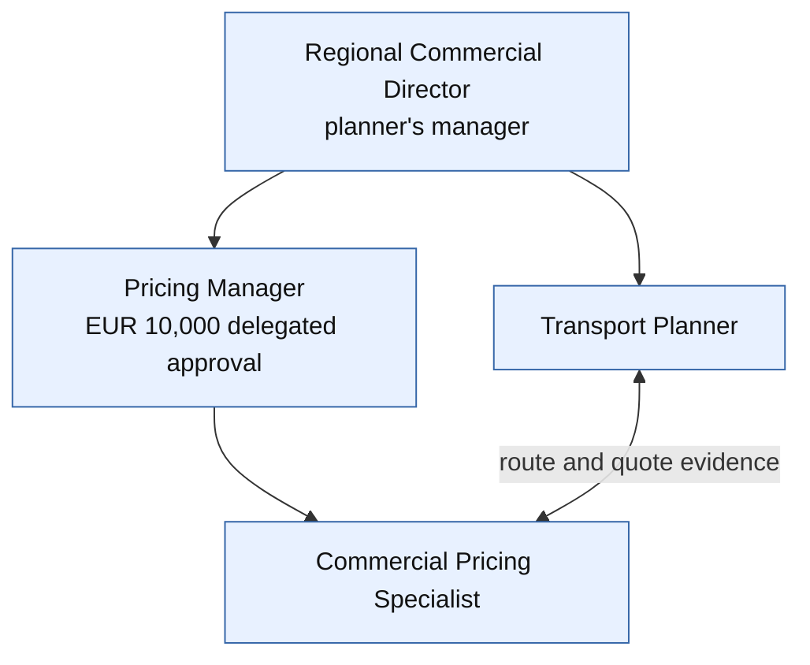

The roles have different responsibilities:

- **Transport Planner** evaluates executable routes and prepares operational
  recommendations.
- **Commercial Pricing Specialist** prepares quotations and compares commercial
  inputs.
- **Pricing Manager** governs pricing and approves
  commercial decisions within the delegated limit.
- **Regional Commercial Director** manages the planner and is the escalation
  point above that limit.

In the current showcase, the policy engine explicitly demonstrates a EUR 10,000
approval limit for the commercial management group. The wider organization may
have more regions and departments, but this example stays with the planner’s
immediate working context.

## A business interruption occurs

Imagine that a quote has already been prepared for freight from Shanghai to
Munich. The customer has been given a price and service expectation, and the
transport plan is based on a particular route and carrier-rate picture.

Then the business world changes:

- the exchange rate moves significantly; or
- a route becomes unavailable because capacity, infrastructure, or an operating
  condition has changed.

The original quote may no longer be commercially or operationally reliable. This
is not a workflow step waiting for someone to click a button. It is a business
interruption that requires the company to reassess an existing commitment.

The Transport Planner now needs to understand the impact, find credible route
alternatives, and check whether they still meet the customer’s service promise.
The Pricing Manager may need to review a commercial deviation or revised quote.
The team needs evidence, options, and a clear indication of where human approval
is required before the company changes its commitment.

## How the planner performs the work here

During onboarding, the new planner is shown the company’s way of performing each
responsibility. The following is the next-level version of the job description:

The diagram below gives the whole flow before the individual subtasks are
explained. Rounded shapes are events, rectangles are work, diamonds are
decisions, and document-shaped nodes represent business information supplied by
or written to a supporting system.

```mermaid
flowchart LR
    start(( )) -->|Shipment request| brief[/Shipment brief\ncustomer requirements/]
    brief --> review[Transport Planner\nreview shipment need]
    review -->|Requirements complete?| complete{ }
    complete -->|No| clarify[Clarify with customer\nor Commercial]
    clarify --> brief
    complete -->|Yes| tms[/TMS\nroute and capacity facts/]
    tms --> rates[/Rate system\ncarrier-rate facts/]
    tms --> options[Compare feasible\nroute options]
    rates --> options
    options -->|Feasible option exists?| feasible{ }
    feasible -->|No| no_lane(( ))
    feasible -->|Yes| recommendation[Transport Planner\nprepare route recommendation]
    recommendation -->|Fits cost and service needs?| fit{ }
    fit -->|Yes| planner[Transport Planner\nreview and accept plan]
    fit -->|No| exception[Record exception\nand prepare escalation]
    exception -->|Commercial approval needed?| approval{ }
    approval -->|No| planner
    approval -->|Yes| quote[/Quotation system\nquote and approval state/]
    quote --> manager[Pricing Manager\nreview commercial decision]
    manager -->|Within delegated EUR 10,000 limit?| limit{ }
    limit -->|Yes| approve[Human approval\nrecorded in quotation system]
    limit -->|No| director[Regional Commercial Director\nescalation]
    approve --> planner
    director --> planner
    planner -->|Route plan ready| finish(( ))

    classDef human fill:#e8f1ff,stroke:#3566a8,color:#111;
    classDef system fill:#fff4d6,stroke:#a87800,color:#111;
    classDef decision fill:#f5eaff,stroke:#7542a5,color:#111,font-size:10px;
    classDef event fill:#ffffff,stroke:#666666,color:#111,font-size:10px;
    class review,clarify,options,recommendation,exception,planner,manager,approve,director human;
    class brief,tms,rates,quote system;
    class complete,feasible,fit,approval,limit decision;
    class start,no_lane,finish event;
```

### 1. Understand the shipment need

**Diagram path:**

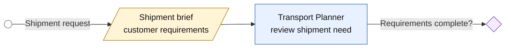

1. Review the customer requirements, service commitments, and shipment
   constraints.
2. Confirm the origin, destination, equipment, timing, and required mode.
3. Identify anything that requires clarification from Commercial, the customer,
   or a carrier.

**The planner owns this understanding.** No system can infer an important
customer commitment that has not been recorded or explained.

### 2. Find feasible transport options

**Diagram path:**

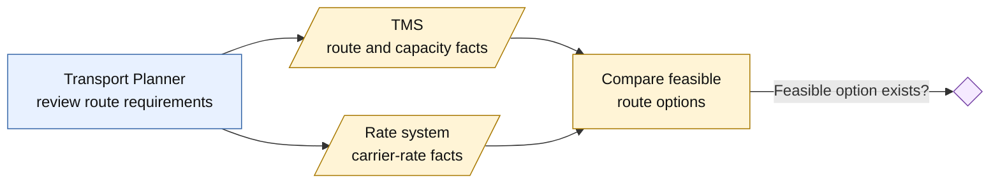

1. Review the available routes and route constraints in the TMS.
2. Check whether the relevant routes have capacity.
3. Check the applicable carrier-rate information.
4. Compare the resulting options and the evidence behind them.

**The planner gathers and compares the evidence, then remains responsible for
deciding whether the options make sense in the real operating context.**

### 3. Prepare a route recommendation

**Diagram path:**

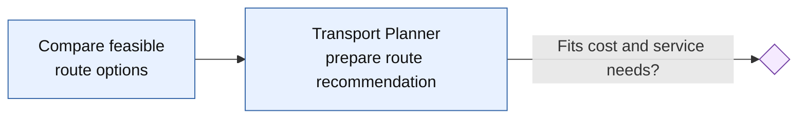

1. Compare the options against cost and service requirements.
2. Prepare a route recommendation with alternatives and assumptions.
3. Review the recommendation, exceptions, and operational consequences.
4. Accept the recommendation, revise the plan, or escalate the exception.

**The recommendation is prepared by the planner; operational judgment remains
with the planner and the authorized human decision-makers.**

### 4. Consider cost and mode together

**Diagram path:**

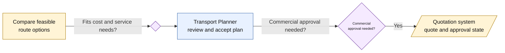

1. Compare carrier rates using the same commercial assumptions.
2. Balance price with service quality, reliability, transit time, and customer
   commitments.
3. Avoid selecting a nominally cheap option that cannot be executed.
4. Explain the recommendation when handing it to Pricing or Commercial.

### 5. Monitor and adjust the shipment

**Diagram path:**

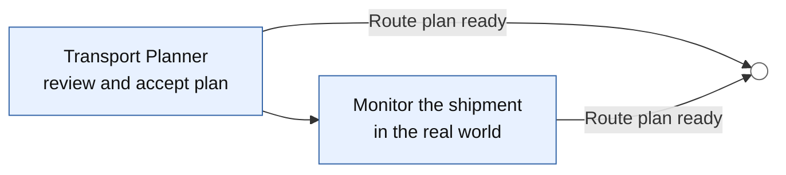

1. Monitor the shipment in the real world.
2. Respond to delays, capacity changes, and carrier issues.
3. Communicate with drivers, carriers, customers, and colleagues.
4. Re-plan when the situation changes.

These activities remain part of the Transport Planner’s job throughout the
process. They are the responsibilities the company will later examine for
carefully bounded support.

## What is enhanced by agents?

The company assigns selected parts of the job to specialist software workers:

The human process remains the reference process. The enhancement is that
selected research and preparation steps can now be performed by specialist
workers, while the planner continues to review the evidence and own the
operational decision.

```mermaid
flowchart LR
    responsibility[Transport Planner<br/>responsibility]
    lane[Lane Evaluation Agent<br/>find feasible options]
    policy[Policy engine<br/>check permitted action]
    tms[/TMS<br/>route and capacity facts/]
    rates[/Rate system<br/>carrier-rate facts/]
    options[/Route options<br/>and evidence/]
    decision[Route Decision Agent<br/>prepare recommendation]
    handoff[Agent hand-off<br/>request capacity evidence]
    planner[Transport Planner<br/>review recommendation]

    responsibility --> lane
    lane -->|controlled service| policy
    policy --> tms
    policy --> rates
    tms --> options
    rates --> options
    options --> decision
    decision --> handoff --> planner

    classDef human fill:#e8f1ff,stroke:#3566a8,color:#111;
    classDef agent fill:#eaf7ea,stroke:#3b7d3b,color:#111;
    classDef system fill:#fff4d6,stroke:#a87800,color:#111;
    classDef decision fill:#f5eaff,stroke:#7542a5,color:#111,font-size:10px;
    class responsibility,planner human;
    class lane,decision,handoff agent;
    class policy,tms,rates,options system;
```

| Planner responsibility | Company support | What the support does |
| --- | --- | --- |
| Create optimized shipment routes | Lane Evaluation Agent | Builds and compares valid route alternatives. |
| Check the lowest freight cost and best mode | Lane Evaluation Agent plus rate service | Compares route options using carrier-rate evidence. |
| Prepare a route recommendation | Route Decision Agent | Produces a recommendation and identifies exceptions. |

The important boundary is that these workers support a responsibility; they do
not become the owner of the job, the shipment, or the company’s operational
truth.

## The agents are specialist colleagues

The company does not use one all-purpose transport agent. It uses separate
specialists with clear responsibilities:

- The **Lane Evaluation Agent** builds and compares route alternatives. It does
  not approve deviations.
- The **Route Decision Agent** prepares a route recommendation. It does not
  approve the recommendation.
- The **Commercial Normalization Agent** belongs to the related pricing flow. It
  makes route costs commercially comparable and prepares quote work, but it
  does not replace the Pricing Manager’s approval authority.

When one specialist asks another specialist for help, the interaction is a
business hand-off: “Please check capacity for this route.” The specialists do
not need to know how the other one is implemented.

## How the company’s systems are used

The agents do not own the company’s facts. The existing systems remain the
authorities:

- the **TMS** remains authoritative for routes and transport capacity;
- the **rate system** remains authoritative for carrier rates;
- the **quotation system** remains authoritative for quote and approval state.

An agent asks a controlled company service for the information it needs. That
service uses the existing system interface and returns the result to the agent.
The existing system is not replaced, and the agent does not create a hidden
copy of its data.

In the technical architecture, the hand-off between agents is called **A2A**.
The controlled service used to access a company system is exposed through
**MCP**, and the service uses the system’s existing **API** underneath. The
business sequence is still simple:

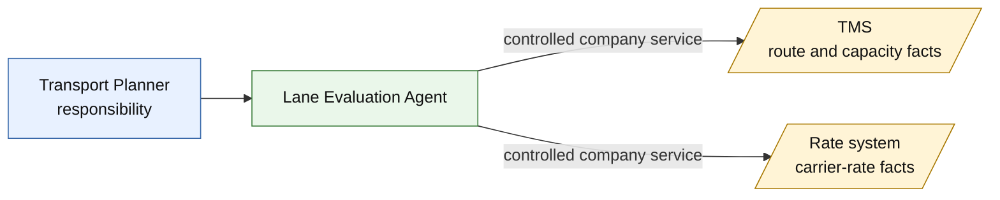

The agents and controlled services have separate machine identities. They do
not inherit a planner’s human group membership. This distinction matters: a
software worker should not gain human approval rights simply because it supports
a human job.

## The policy engine protects business actions

In a company, a policy is a clear business rule about who may do what, under
which circumstances. It turns responsibilities and approval limits into rules
that can be applied consistently—for example, “this role may approve a route
deviation up to EUR 10,000,” or “this service may read carrier rates.”

Policies are especially important when software workers act on behalf of the
business. In this showcase, policies explicitly govern the agents. They decide
which agent may evaluate a lane, check capacity, read rates, or pass work to
another approved agent. They also make clear which actions remain reserved for
people.

When an agent requests a business action, the request passes through the
control-panel Policy Enforcement Point before it can affect a company system.
The control panel asks the policy engine whether that particular agent may
perform that particular action in that situation. The showcase therefore
demonstrates policies for both agent actions and human approval actions:

| Policy | Business meaning |
| --- | --- |
| `agent-may-evaluate-lane` | An active agent may evaluate lane options. |
| `agent-may-check-capacity` | Only an active company service in the trusted internal environment may check route capacity. |
| `agent-may-read-carrier-rate` | Only an active company service in the trusted internal environment may read carrier rates. |
| `agent-may-connect-same-trust-domain` | A service may connect only to an active company service in the same trusted environment. |
| `agent-may-delegate-per-catalog` | An agent may hand work only to an approved specialist listed in its service catalog. |
| `recommend-noncontracted-lane` | A non-contracted route may be recommended, but an additional review is required. |
| `recommend-high-cost-variance` | A recommendation more than 8% above baseline requires cost review. |
| `recommend-slower-transit` | A recommendation adding more than three transit days requires operations review. |
| `forbid-inactive` | An inactive identity cannot perform a controlled action. |

This gives the process a simple business boundary:

- agents may gather evidence and prepare recommendations within their assigned
  responsibilities;
- the policy engine can refuse an agent action even when the agent is technically
  able to request it; and
- a human approval remains a human approval, with the organization and delegated
  limit checked explicitly.

### Example: an agent checks route capacity

The Lane Evaluation Agent requests a route-capacity check as part of its
agentic route evaluation. The showcase includes a policy governing that request.
The rule has this shape:

```text
permit(
  principal,
  action == Agentic::Action::"capacity.check",
  resource
) when {
  principal.active == true &&
  principal has trust_domain &&
  principal.trust_domain == "internal"
};
```

In business terms, the company is saying:

> Only an active company service operating inside the trusted logistics
> environment may check whether a route has capacity. Inactive services and
> callers from outside that environment are refused.

### Example: an agent prepares a route deviation for human approval

The Route Decision Agent may prepare the route-deviation recommendation and its
supporting evidence. It cannot approve the deviation. The showcase includes a
separate policy for the approval action. Route recommendation and route approval
are different responsibilities; the approval rule is reserved for the human
commercial management group:

```text
permit(
  principal in Agentic::Group::"rfq-commercial-emea",
  action == Agentic::Action::"route-deviation.approve",
  resource
) when {
  context.quote_value_eur_cents <= 1000000
};
```

In business terms, the company is saying:

> A member of the EMEA commercial management group may approve a route
> deviation up to EUR 10,000. The route agents may prepare evidence and
> recommendations, but they cannot perform the approval action.

The agent catalog makes the same boundary explicit by listing
`route-deviation.approve` as prohibited for both the Lane Evaluation Agent and
the Route Decision Agent. The agent may help prepare a business decision; it may
not turn that preparation into an unauthorized commitment.

## Human-in-the-loop approvals

Some decisions are deliberately kept with people because they change the
company’s commercial commitment. The agents can investigate the situation,
compare alternatives, and prepare a recommendation, but they do not silently
turn that recommendation into an approved quote or route deviation.

The approval boundary works as follows:

1. An agent prepares the recommendation and the evidence behind it.
2. The control panel checks whether the requested approval is allowed for the
   person, group, business action, and amount involved.
3. An authorized human reviews the recommendation and accepts, changes, or
   rejects it.
4. The approval and its outcome are recorded in the quotation system.

For this showcase, the Pricing Manager may approve a route deviation up to the
delegated EUR 10,000 limit. A request above that limit is escalated to the
Regional Commercial Director. The agent remains involved as a source of
evidence and preparation, but the accountable human decision stays visible.

```mermaid
flowchart LR
    agent[Route Decision Agent<br/>prepare recommendation and evidence]
    pep[Control panel<br/>check requested action]
    policy[Policy engine<br/>apply business rules]
    allowed{ }
    planner[Transport Planner<br/>review recommendation]
    specialist[Commercial Pricing Specialist<br/>check commercial evidence]
    pricing[Pricing Manager<br/>EUR 10,000 delegated approval]
    limit{ }
    approve[Human approval<br/>accept route deviation]
    director[Regional Commercial Director<br/>planner's manager]
    quote[/Quotation system<br/>record decision/]
    refused(( ))

    agent --> pep --> policy -->|Approval allowed?| allowed
    allowed -->|No| refused
    allowed -->|Yes| planner
    planner --> specialist -->|Commercial decision needed?| pricing
    pricing -->|Within EUR 10,000 limit?| limit
    limit -->|Yes| approve --> quote
    limit -->|No| director --> quote

    classDef human fill:#e8f1ff,stroke:#3566a8,color:#111;
    classDef agent fill:#eaf7ea,stroke:#3b7d3b,color:#111;
    classDef system fill:#fff4d6,stroke:#a87800,color:#111;
    classDef decision fill:#f5eaff,stroke:#7542a5,color:#111,font-size:10px;
    classDef event fill:#ffffff,stroke:#666666,color:#111,font-size:10px;
    class agent agent;
    class pep,policy,quote system;
    class planner,specialist,pricing,approve,director human;
    class allowed,limit decision;
    class refused event;
```

## What remains with the Transport Planner

The Transport Planner still:

- decides how recommendations fit customer commitments and service priorities;
- validates whether a recommendation is realistic;
- monitors real-world execution;
- communicates with carriers and drivers;
- handles exceptions outside the current capabilities; and
- accepts, revises, or escalates a recommendation.

The agent is a bounded colleague for selected analytical and preparatory work.
It is not a digital replacement for the complete job.

## Source projection

This example is based on the generated projection:

- [workload-to-jobs.yaml](../../data/story/workload-to-jobs.yaml)
- [job-titles.yaml](../../business/job-titles.yaml)
- [job-workload-mappings.yaml](../../business/job-workload-mappings.yaml)
- [agents/catalog.yaml](../../agents/catalog.yaml)
- [policies](../../authorization/policies.cedar)
