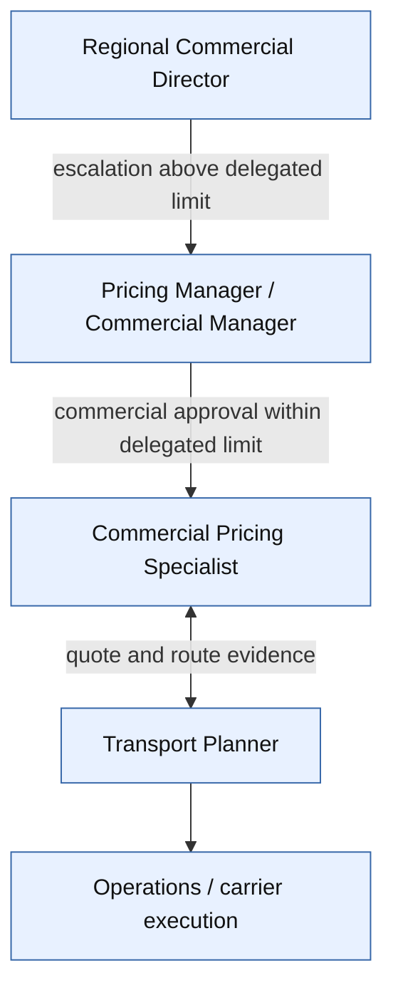
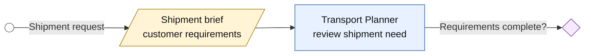
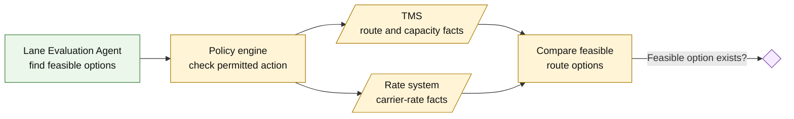
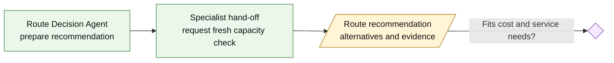
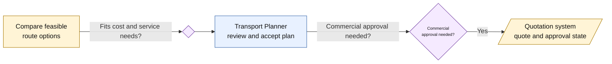
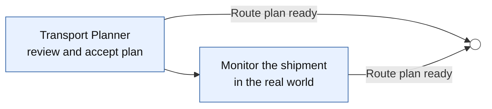
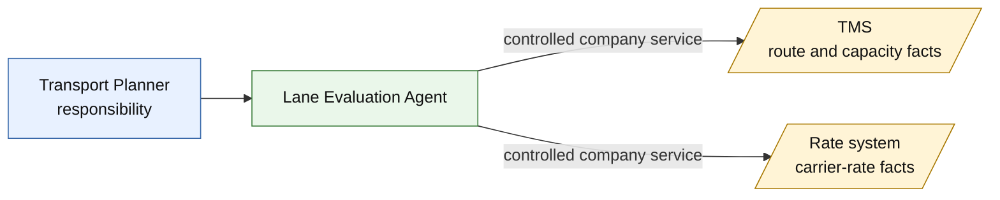

# Transport Planner — an agentically enhanced job

This is an onboarding example for a logistics company that uses software
workers to support selected responsibilities in an existing job.

The job does not disappear. The planner still understands the customer’s needs,
weighs competing priorities, and takes responsibility for the operational
decision. Some of the research and preparation around that decision is carried
out by specialist company services.

## Meet the Transport Planner

A Transport Planner plans, tenders, and routes daily shipments. They are
expected to:

- create routes that fit distance, time, traffic, and customer requirements;
- identify suitable cost and transport-mode options;
- monitor shipments and adjust plans when conditions change;
- communicate with carriers and drivers; and
- analyze carrier trends and service issues.

This is a broad job. The company does not treat every responsibility as a
candidate for automation. It selects a few activities where software can gather
evidence and prepare useful work for the planner.

## The wider team and approval hierarchy

The Transport Planner is part of a wider commercial and operational chain. The
company does not ask the planner to make every decision alone:



The roles have different responsibilities:

- **Transport Planner** evaluates executable routes and prepares operational
  recommendations.
- **Commercial Pricing Specialist** prepares quotations and compares commercial
  inputs.
- **Pricing Manager / Commercial Manager** governs pricing and approves
  commercial decisions within the delegated limit.
- **Regional Commercial Director** is the escalation point above that limit.

In the current showcase, the policy engine explicitly demonstrates a EUR 10,000
approval limit for the EMEA commercial management group. The directory contains
regional planning, pricing, and commercial groups for EMEA, APAC, and AMER. The
organizational hierarchy is therefore broader than the one Transport Planner
example; the example focuses on one position inside that hierarchy.

## A shipment arrives

Imagine a request to move freight from Shanghai to Munich.

The planner needs to understand the customer’s required delivery date, the
equipment, the available modes, route constraints, carrier capacity, and likely
cost. A route that is cheapest on paper may be unsuitable if it is too slow,
unavailable, or inconsistent with the customer’s service promise.

The planner therefore needs more than a single answer. They need a set of
credible options, the evidence behind those options, and a clear indication of
where a business decision or approval is required.

## How the planner performs the work here

During onboarding, the new planner is shown the company’s way of performing each
responsibility. The following is the next-level version of the job description:

The diagram below gives the whole flow before the individual subtasks are
explained. Rounded shapes are events, rectangles are work, diamonds are
decisions, and document-shaped nodes represent business information supplied by
or written to a supporting system.

```mermaid
flowchart LR
    start(( )) -->|Shipment request| brief[/Shipment brief\ncustomer requirements/]
    brief --> review[Transport Planner\nreview shipment need]
    review -->|Requirements complete?| complete{ }
    complete -- No -->|No| clarify[Clarify with customer\nor Commercial]
    clarify --> brief
    complete -- Yes -->|Yes| evaluate[Lane Evaluation Agent\nfind feasible options]

    evaluate --> policy1[Policy engine\ncheck permitted action]
    policy1 --> tms[/TMS\nroute and capacity facts/]
    policy1 --> rates[/Rate system\ncarrier-rate facts/]
    tms --> options[Compare feasible\nroute options]
    rates --> options
    options -->|Feasible option exists?| feasible{ }
    feasible -- No -->|No| no_lane(( ))
    feasible -- Yes -->|Yes| recommend[Route Decision Agent\nprepare recommendation]

    recommend --> a2a[Specialist hand-off\nrequest fresh capacity check]
    a2a --> recommendation[/Route recommendation\nalternatives and evidence/]
    recommendation -->|Fits cost and service needs?| fit{ }
    fit -- Yes -->|Yes| planner[Transport Planner\nreview and accept plan]
    fit -- No -->|No| exception[Record exception\nand prepare escalation]
    exception -->|Commercial approval needed?| approval{ }
    approval -- No -->|No| planner
    approval -- Yes -->|Yes| quote[/Quotation system\nquote and approval state/]
    quote --> manager[Pricing Manager\nreview commercial decision]
    manager -->|Within delegated EUR 10,000 limit?| limit{ }
    limit -- Yes --> approve[Human approval\nrecorded in quotation system]
    limit -- No --> director[Regional Commercial Director\nescalation]
    approve --> planner
    director --> planner
    planner -->|Route plan ready| finish(( ))

    classDef human fill:#e8f1ff,stroke:#3566a8,color:#111;
    classDef agent fill:#eaf7ea,stroke:#3b7d3b,color:#111;
    classDef system fill:#fff4d6,stroke:#a87800,color:#111;
    classDef decision fill:#f5eaff,stroke:#7542a5,color:#111,font-size:10px;
    class review,clarify,planner,manager,director human;
    class evaluate,recommend,a2a agent;
    class brief,tms,rates,recommendation,quote system;
    class complete,feasible,fit,approval,limit decision;
```

### 1. Understand the shipment need

**Diagram path:**



1. Review the customer requirements, service commitments, and shipment
   constraints.
2. Confirm the origin, destination, equipment, timing, and required mode.
3. Identify anything that requires clarification from Commercial, the customer,
   or a carrier.

**The planner owns this understanding.** No agent can infer an important
customer commitment that has not been recorded or explained.

### 2. Find feasible transport options

**Diagram path:**



1. Ask the company’s route specialist to evaluate available lanes.
2. The route specialist checks whether the relevant routes have capacity.
3. It checks the applicable carrier-rate information.
4. The planner reviews the resulting options and the evidence behind them.

**The agent gathers and compares evidence. The planner remains responsible for
deciding whether the options make sense in the real operating context.**

### 3. Prepare a route recommendation

**Diagram path:**



1. Ask the company’s decision specialist to compare the options against cost and
   service requirements.
2. The decision specialist may ask the route specialist for a fresh capacity
   check.
3. Review the recommended route, alternatives, assumptions, and exceptions.
4. Accept the recommendation, revise the plan, or escalate the exception.

**The recommendation is prepared by software; the operational judgment remains
with the planner and the authorized human decision-makers.**

### 4. Consider cost and mode together

**Diagram path:**



1. Compare carrier rates using the same commercial assumptions.
2. Balance price with service quality, reliability, transit time, and customer
   commitments.
3. Avoid selecting a nominally cheap option that cannot be executed.
4. Explain the recommendation when handing it to Pricing or Commercial.

### 5. Continue the human work

**Diagram path:**



1. Monitor the shipment in the real world.
2. Respond to delays, capacity changes, and carrier issues.
3. Communicate with drivers, carriers, customers, and colleagues.
4. Re-plan when the situation changes.

These activities remain part of the Transport Planner’s job even when agents
support the earlier research and preparation.

## What is enhanced by agents?

The company assigns selected parts of the job to specialist software workers:

| Planner responsibility | Company support | What the support does |
| --- | --- | --- |
| Create optimized shipment routes | Lane Evaluation Agent | Builds and compares valid route alternatives. |
| Check the lowest freight cost and best mode | Lane Evaluation Agent plus rate service | Compares route options using carrier-rate evidence. |
| Prepare a route recommendation | Route Decision Agent | Produces a recommendation and identifies exceptions. |

The important boundary is that these workers support a responsibility; they do
not become the owner of the job, the shipment, or the company’s operational
truth.

## The agents are specialist colleagues

The company does not use one all-purpose transport agent. It uses separate
specialists with clear responsibilities:

- The **Lane Evaluation Agent** builds and compares route alternatives. It does
  not approve deviations.
- The **Route Decision Agent** prepares a route recommendation. It does not
  approve the recommendation.
- The **Commercial Normalization Agent** belongs to the related pricing flow. It
  makes route costs commercially comparable and prepares quote work, but it
  does not replace the Pricing Manager’s approval authority.

When one specialist asks another specialist for help, the interaction is a
business hand-off: “Please check capacity for this route.” The specialists do
not need to know how the other one is implemented.

## How the company’s systems are used

The agents do not own the company’s facts. The existing systems remain the
authorities:

- the **TMS** remains authoritative for routes and transport capacity;
- the **rate system** remains authoritative for carrier rates;
- the **quotation system** remains authoritative for quote and approval state.

An agent asks a controlled company service for the information it needs. That
service uses the existing system interface and returns the result to the agent.
The existing system is not replaced, and the agent does not create a hidden
copy of its data.

In the technical architecture, the hand-off between agents is called **A2A**.
The controlled service used to access a company system is exposed through
**MCP**, and the service uses the system’s existing **API** underneath. The
business sequence is still simple:



## The organization behind the role

The directory data can be presented as a conventional organization chart. This
is the human structure in which the Transport Planner works; it is not an agent
architecture diagram.

```mermaid
flowchart TD
    subgraph EMEA[EMEA]
        diane[Diane Delgado<br/>Regional Commercial Director]
        mona[Mona Caldwell<br/>Pricing Manager<br/>EUR 10,000 delegated approval]
        sam[Marek Petrov<br/>Commercial Pricing Specialist]
        wei[Wei Chen<br/>Transport Planner]
        diane --> mona
        mona --> sam
        diane --> wei
    end

    subgraph APAC[APAC]
        lin[Lin Zhao<br/>Regional Commercial Director]
        priya[Priya Nair<br/>Pricing Manager<br/>EUR 10,000 delegated approval]
        tomas[Tomas Reyes<br/>Commercial Pricing Specialist]
        mei[Mei Lin<br/>Transport Planner]
        lin --> priya
        priya --> tomas
        lin --> mei
    end

    subgraph AMER[AMER]
        omar[Omar Haddad<br/>Regional Commercial Director]
        carla[Carla Mendes<br/>Pricing Manager<br/>EUR 10,000 delegated approval]
        diego[Diego Alvarez<br/>Commercial Pricing Specialist]
        javier[Javier Torres<br/>Transport Planner]
        omar --> carla
        carla --> diego
        omar --> javier
    end

    classDef human fill:#e8f1ff,stroke:#3566a8,color:#111;
    class diane,mona,sam,wei,lin,priya,tomas,mei,omar,carla,diego,javier human;
```



This chart is derived from the directory actors and their `manager` links. The
corresponding directory groups are:

- `/Front-Office/Planning/EMEA`, `/Front-Office/Planning/APAC`, and
  `/Front-Office/Planning/AMER` for Transport Planners;
- `/Back-Office/Pricing/EMEA`, `/Back-Office/Pricing/APAC`, and
  `/Back-Office/Pricing/AMER` for Commercial Pricing Specialists;
- `/Front-Office/Commercial/EMEA`, `/Front-Office/Commercial/APAC`, and
  `/Front-Office/Commercial/AMER` for commercial management.

The directory may be provided by Keycloak or Entra ID. It tells the company who
a person is, which organizational group they belong to, and which management or
approval context applies.

The agents and controlled services have separate machine identities. They do
not inherit a planner’s human group membership. This distinction matters: a
software worker should not gain human approval rights simply because it supports
a human job.

## The policy engine protects business actions

Before a software worker checks capacity, reads a rate, or prepares a route
recommendation, the company checks whether that worker is allowed to perform
the requested action.

The control-panel Policy Enforcement Point applies the answer from the policy
engine. The relevant rules in this example cover:

| Policy | Business meaning |
| --- | --- |
| `agent-may-evaluate-lane` | An active agent may evaluate lane options. |
| `agent-may-check-capacity` | Only an active company service in the trusted internal environment may check route capacity. |
| `agent-may-read-carrier-rate` | Only an active company service in the trusted internal environment may read carrier rates. |
| `agent-may-connect-same-trust-domain` | A service may connect only to an active company service in the same trusted environment. |
| `agent-may-delegate-per-catalog` | An agent may hand work only to an approved specialist listed in its service catalog. |
| `recommend-noncontracted-lane` | A non-contracted route may be recommended, but an additional review is required. |
| `recommend-high-cost-variance` | A recommendation more than 8% above baseline requires cost review. |
| `recommend-slower-transit` | A recommendation adding more than three transit days requires operations review. |
| `forbid-inactive` | An inactive identity cannot perform a controlled action. |

### Example: checking route capacity

The policy-engine rule behind the business statement above has this shape:

```text
permit(
  principal,
  action == Agentic::Action::"capacity.check",
  resource
) when {
  principal.active == true &&
  principal has trust_domain &&
  principal.trust_domain == "internal"
};
```

In business terms:

> Only an active company service operating inside the trusted logistics
> environment may check whether a route has capacity. Inactive services and
> callers from outside that environment are refused.

### Example: approving a route deviation

Route recommendation and route approval are different responsibilities. The
approval rule is reserved for the human commercial management group:

```text
permit(
  principal in Agentic::Group::"rfq-commercial-emea",
  action == Agentic::Action::"route-deviation.approve",
  resource
) when {
  context.quote_value_eur_cents <= 1000000
};
```

In business terms:

> A member of the EMEA commercial management group may approve a route
> deviation up to EUR 10,000. The route agents may prepare evidence and
> recommendations, but they cannot perform the approval action.

The agent catalog makes the same boundary explicit by listing
`route-deviation.approve` as prohibited for both the Lane Evaluation Agent and
the Route Decision Agent. The agent may help prepare a business decision; it may
not turn that preparation into an unauthorized commitment.

## What remains with the Transport Planner

The Transport Planner still:

- decides how recommendations fit customer commitments and service priorities;
- validates whether a recommendation is realistic;
- monitors real-world execution;
- communicates with carriers and drivers;
- handles exceptions outside the current capabilities; and
- accepts, revises, or escalates a recommendation.

The agent is a bounded colleague for selected analytical and preparatory work.
It is not a digital replacement for the complete job.

## Source projection

This example is based on the generated projection:

- [workload-to-jobs.yaml](../../data/story/workload-to-jobs.yaml)
- [job-titles.yaml](../../business/job-titles.yaml)
- [job-workload-mappings.yaml](../../business/job-workload-mappings.yaml)
- [agents/catalog.yaml](../../agents/catalog.yaml)
- [policies](../../authorization/policies.cedar)
